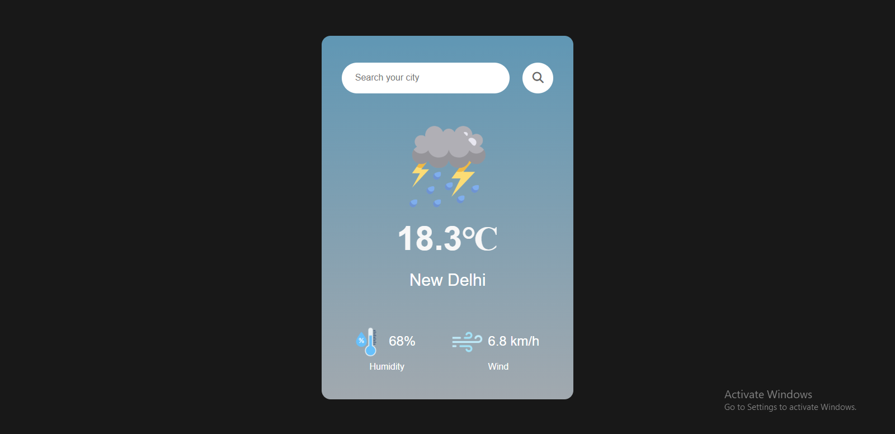
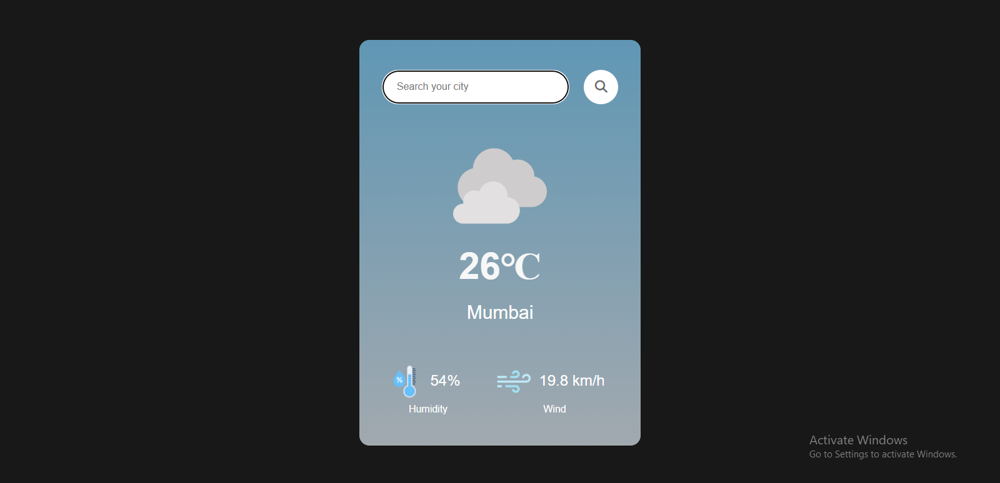
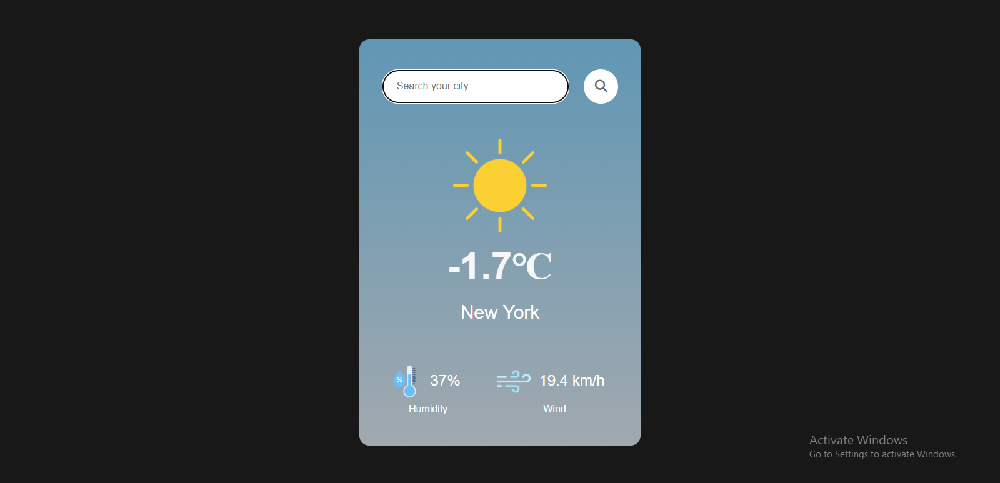
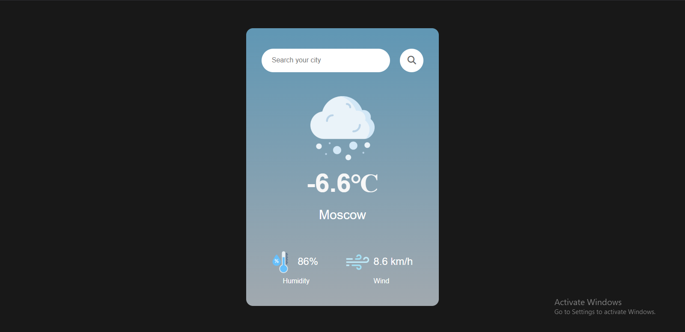

# 🌤️ Weather App

## 📌 Overview

This is a simple Weather App that allows users to search for weather conditions in any city. It fetches real-time weather data from the WeatherAPI and displays information such as temperature, humidity, wind speed, and weather icons representing the current conditions.

## ✨ Features

✅ Search weather conditions for any city 🌍
✅ Displays real-time temperature 🌡️, humidity 💧, and wind speed 🌬️
✅ Dynamic weather icons 🎨
✅ Handles invalid city inputs with error messages ⚠️
✅ Error handling for API failures and unexpected responses 🛠️
✅ Responsive and modern UI using Bootstrap 🎨

## 🛠️ Technologies Used

- HTML 🏗️
- CSS 🎨 (with Bootstrap)
- JavaScript 💻
- WeatherAPI 🌍 (for fetching weather data)

## 🚀 Installation and Usage

### 1️⃣ Clone the Repository

```sh
git clone https://github.com/thebeliever1812/Weather-web-app.git
```

### 2️⃣ Open in Browser

Simply open the `index.html` file in your web browser.

### 3️⃣ API Key Setup 🔑

This app uses WeatherAPI for fetching weather data. To use it with your own API key:

1. Go to [WeatherAPI](https://www.weatherapi.com/) and sign up for an API key.
2. Replace the existing API key in `script.js` with your own:
   ```js
   let apiUrl = `https://api.weatherapi.com/v1/current.json?key=YOUR_API_KEY&q=${city_name}`
   ```

## 📂 File Structure

```
weather-app/
│── index.html        # 🌍 Main HTML file
│── style.css         # 🎨 Stylesheet for the app
│── script.js         # ⚙️ JavaScript logic for fetching and displaying weather
│── images/           # 🖼️ Folder containing weather icons
│── README.md         # 📖 Project documentation
```

## 📸 Screenshots

Here are some example screenshots:

### 🌆 New Delhi


### 🌆 Mumbai


### 🗽 New York


### 🏰 Moscow


## 🛠️ Error Handling

This app includes error handling for various situations:

- **Invalid City Name**: Displays a message if the entered city is not found.
- **Unexpected Server Responses**: If the server returns an unexpected status code, the app throws an error with a message like `Unexpected error occurred (status code). Please try again`.

## 🤝 Contributions

Feel free to fork this project, raise issues, or submit pull requests for improvements! 🚀